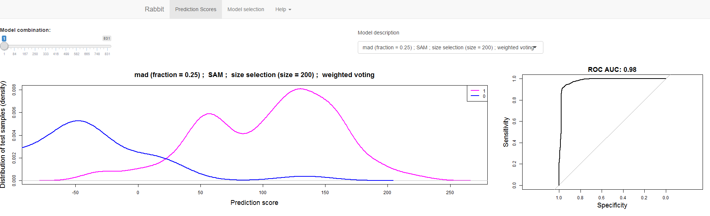
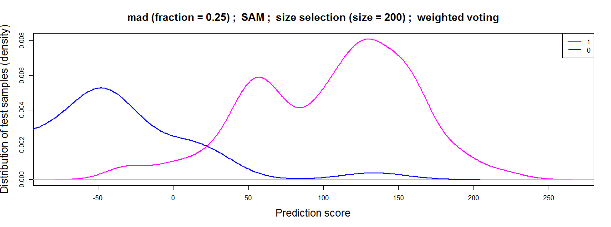
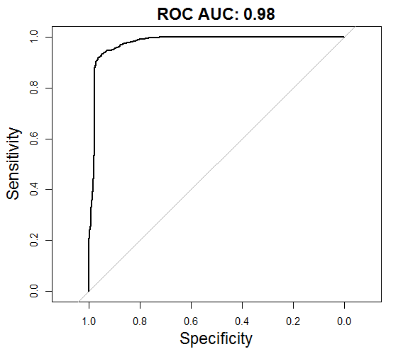
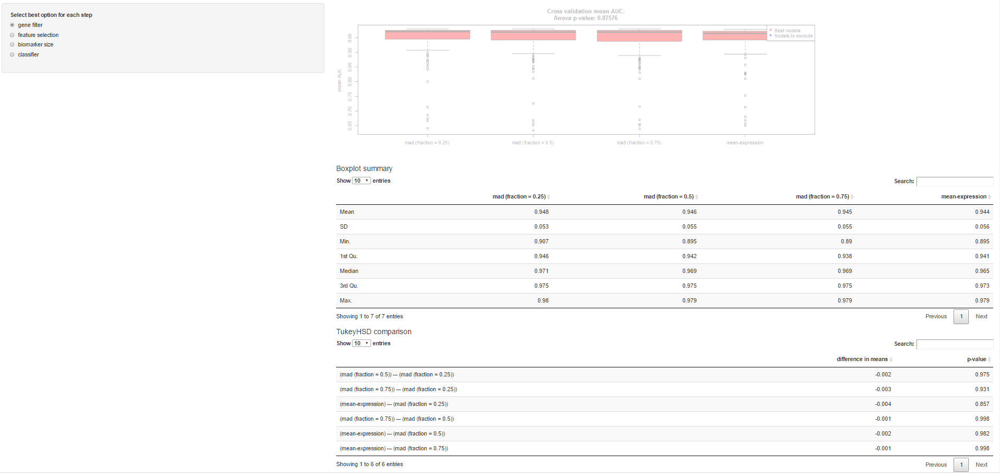
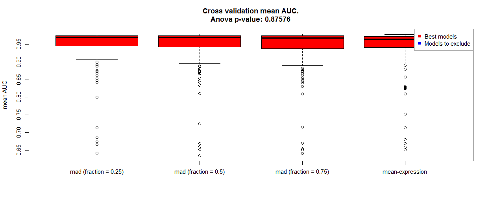
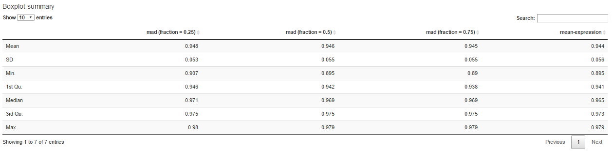
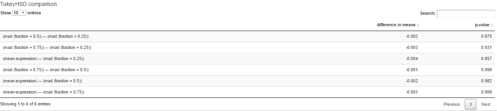

# rabbitGUI

## A Graphical User Interface (GUI) for Genomic Classifiers 

**rabbitGUI** is a friendly user interface for the visual interpretation of biomarkers generated by **Rabbit** pipeline (https://github.com/jperezrogers/rabbit). We visualize the prediction scores using density plots, and evaluate the performance based on the Area Under the Receiver Operator Curve (ROC AUC). The mean AUC is summarized using boxplots across different feature filters, feature selection methods, biomarker sizes and prediction models. rabbitGUI is developed in **R**, and requires R to be installed.

To be able to run **Rabbit** and **RabbitGUI**, first install the following dependencies:
* **Caret**: pbkrtest (R >= 3.2.3), car (R >= 3.2.0), nlme (R >= 3.0.2),
* **Rabbit**: devtools, multtest, impute, samr, e1071, randomForest, klaR, kernlab, pROC, glmnet, limma, genefilter
* **RabbitGUI**: shiny, DT, pROC, ROCR, markdown

Then, execute the file *runRabbit.bat*.

rabbitGUI consists of two main panels. The first panel (*Prediction Scores*) shows all tested biomarkers sorted by the AUC in descending order. Each model can be selected from a drop-down menu and a slide bar.

This panel consists of two plots: the distribution of test samples per prediction score and the Area Under the Receiver Operator Curve (ROC AUC) of the selected classification model.

| Density plot | ROC plot |
| ------------ | -------- |
| ||

The second panel (*Model selection*) displays the performance of the models for each biomarker discovery step. 

*Model selection* contains boxplots that summarize the mean AUC across different groups of models. The top significant groups of models are highlighted in red.

The model statistics (top) and the results from the Tukey test used to discriminate the best groups (bottom) are shown below.

